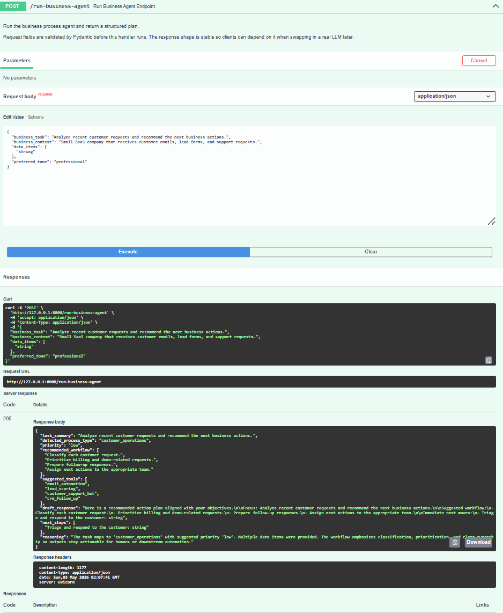

# AI Business Process Agent (Portfolio API)

[](https://github.com/vodolij888Igor/ai-business-process-agent/actions/workflows/tests.yml)

## Project overview

This repository contains a **Python FastAPI** backend for an **AI Business Process Agent**: a service that accepts a business objective, organizational context, and optional unstructured data, then returns a **structured, AI-ready business process plan** produced by **OpenAI** (structured JSON output). The stable response schema lets you plug in workflow engines or CRMs without changing clients.

This project is intended as a portfolio piece for roles such as **AI Automation Engineer**, **AI Integration Developer**, **Full-Stack AI Product Developer**, and **AI Creator**.

## Business use case

Operations and customer-facing teams often receive mixed signals: emails, form submissions, support tickets, and ad hoc notes. This API **normalizes that situation into an actionable plan**: inferred process category, priority, ordered workflow steps, suggested tool categories, a draft narrative, and concrete next steps. In production, the same shape could feed ticketing systems, playbooks, or AI assistants.

## Tech stack

| Layer        | Choice                          |
| ------------ | ------------------------------- |
| Framework    | FastAPI                         |
| Validation   | Pydantic v2                     |
| Server       | Uvicorn                         |
| Language     | Python 3.10+ recommended        |
| AI           | OpenAI API (structured outputs) |

**Scope:** no database, no frontend, and **no execution of external tools**—only validated HTTP JSON in/out. Business analysis is performed by **OpenAI** using `OPENAI_API_KEY`; see `app/services/agent_service.py`.

## Setup instructions

1. **Python environment** (3.10 or newer recommended):

   ```bash
   python -m venv .venv
   ```

2. **Activate the virtual environment**

   - Windows (PowerShell): `.venv\Scripts\Activate.ps1`
   - macOS/Linux: `source .venv/bin/activate`

3. **Install dependencies**

   ```bash
   pip install -r requirements.txt
   ```

4. **Configure OpenAI:** copy `.env.example` to `.env` and set `OPENAI_API_KEY` (required for `POST /run-business-agent`). The app loads `.env` via `python-dotenv` when the service module loads.

5. **Run the API** (from the project root):

   ```bash
   uvicorn app.main:app --reload --host 127.0.0.1 --port 8000
   ```

6. **Open interactive docs:** [http://127.0.0.1:8000/docs](http://127.0.0.1:8000/docs)

## Running tests

Automated tests mock the OpenAI client so they **do not** call the real API and **do not** require a valid `OPENAI_API_KEY`.

```bash
pip install -r requirements.txt
pytest
```

## API

### `POST /run-business-agent`

Accepts a JSON body describing the task and context; returns a structured process plan.

### Sample request

```http
POST /run-business-agent HTTP/1.1
Content-Type: application/json
```

```json
{
  "business_task": "Analyze recent customer requests and recommend the next business actions.",
  "business_context": "Small SaaS company that receives customer emails, lead forms, and support requests.",
  "data_items": [
    "Customer A asked about pricing and wants a demo.",
    "Customer B reported a billing issue.",
    "Customer C asked whether the product integrates with Google Sheets."
  ],
  "preferred_tone": "professional"
}
```

### Sample response

```json
{
  "task_summary": "Analyze recent customer requests and recommend the next business actions.",
  "detected_process_type": "customer_operations",
  "priority": "high",
  "recommended_workflow": [
    "Classify each customer request.",
    "Prioritize billing and demo-related requests.",
    "Prepare follow-up responses.",
    "Assign next actions to the appropriate team."
  ],
  "suggested_tools": [
    "email_automation",
    "lead_scoring",
    "customer_support_bot",
    "crm_follow_up"
  ],
  "draft_response": "Here is a recommended action plan for handling the recent customer requests...",
  "next_steps": [
    "Contact Customer B about the billing issue.",
    "Schedule a demo with Customer A.",
    "Send integration details to Customer C."
  ],
  "reasoning": "The task includes multiple customer-facing requests that require classification, prioritization, and follow-up."
}
```

**Note:** Actual field values are generated by **OpenAI** from your inputs and may differ in wording while preserving the same schema. If `OPENAI_API_KEY` is missing, the API returns **503**. If the OpenAI request fails, it returns **502**.

### Health check

`GET /health` returns `{"status":"ok"}`.

## Screenshot

The screenshot below shows a successful POST /run-business-agent request in FastAPI Swagger UI with a 200 response.



## API usage examples

The examples below assume the API is running locally on port **8000** and that `OPENAI_API_KEY` is configured. Use them to exercise **`POST /run-business-agent`** from the terminal or from API clients such as Postman.

**Scenario:** A small business or SaaS team receives a mix of **customer**, **sales**, **support**, and **operations** signals (email, chat, forms). The agent classifies the work, proposes a workflow, suggests relevant tool categories (as labels only), drafts a stakeholder-ready summary, and lists concrete **next steps**.

### cURL

Send a JSON body with `Content-Type: application/json`:

```bash
curl -s -X POST "http://127.0.0.1:8000/run-business-agent" \
  -H "Content-Type: application/json" \
  -d '{
    "business_task": "Review inbound messages from today and recommend how we should prioritize sales follow-ups, support tickets, and operational tasks.",
    "business_context": "Small SaaS team: shared inbox, CRM leads, helpdesk queue, and internal ops requests; limited bandwidth so triage must be explicit.",
    "data_items": [
      "Sales: Prospect asked for pricing and a 30-minute demo next week.",
      "Support: Existing customer cannot export reports after the latest release.",
      "Operations: Finance needs subscription revenue reconciled by Friday.",
      "Customer: User asked whether we integrate with Salesforce and Google Sheets."
    ],
    "preferred_tone": "professional"
  }'
```

On Windows PowerShell you can use `curl.exe` with the same URL and headers, or paste the JSON into a file and pass `@payload.json` with `curl.exe` as appropriate for your shell.

### Example successful JSON response

A **200** response returns the structured plan. Shape is stable; wording may vary slightly depending on the model run.

```json
{
  "task_summary": "Analyze customer requests and recommend next business actions.",
  "detected_process_type": "customer_operations",
  "priority": "high",
  "recommended_workflow": [
    "Classify each customer request.",
    "Prioritize billing and demo-related requests.",
    "Prepare follow-up responses.",
    "Assign next actions to the appropriate team."
  ],
  "suggested_tools": [
    "email_automation",
    "customer_support_bot",
    "crm_follow_up"
  ],
  "draft_response": "...",
  "next_steps": [
    "Contact Customer B about the billing issue.",
    "Schedule a demo with Customer A.",
    "Send integration details to Customer C."
  ],
  "reasoning": "The task includes multiple customer-facing requests that require classification, prioritization, and follow-up."
}
```

### Postman

1. Create a new request: **Method** `POST`, **URL** `http://127.0.0.1:8000/run-business-agent`.
2. Under **Headers**, add **`Content-Type`** = **`application/json`** (Postman often sets this automatically when you choose JSON body).
3. Under **Body**, select **raw**, choose **JSON**, and paste the same payload structure as in the cURL example (`business_task`, `business_context`, `data_items`, `preferred_tone`).
4. **Send** the request. On success, verify **`task_summary`**, **`detected_process_type`**, **`priority`**, **`recommended_workflow`**, **`suggested_tools`**, **`draft_response`**, **`next_steps`**, and **`reasoning`** in the response panel.

## Architecture

The API is organized as a thin **FastAPI** surface over a **service layer** that performs OpenAI-backed analysis and returns a fixed JSON contract.

- The FastAPI app exposes **`POST /run-business-agent`** for agent-style planning.
- **Pydantic** schemas validate incoming requests and outgoing responses at the HTTP boundary.
- The **service layer** orchestrates OpenAI for business process analysis and structured, agent-style planning (workflow steps, tool suggestions as labels, draft text, and rationale).
- **Environment variables** (including `OPENAI_API_KEY`) are loaded from a local **`.env`** file via `python-dotenv` when the service module loads.
- **Swagger UI** at `/docs` provides interactive request/response testing against the live OpenAPI schema.
- **Automated tests** mock the OpenAI client so the AI layer is never called during CI; they assert HTTP behavior and response shape safely.
- The current release accepts **business tasks**, **business context**, and optional **data items** as JSON only—there is no separate ingestion pipeline.

**Request flow (high level):**

```text
Client / Swagger / Postman
        ↓
FastAPI route: POST /run-business-agent
        ↓
Pydantic validation
        ↓
Business process agent service layer
        ↓
OpenAI API
        ↓
JSON response: task_summary, detected_process_type, priority, recommended_workflow, suggested_tools, draft_response, next_steps, reasoning
```

## Limitations

This repository is a **backend portfolio project**, not a complete autonomous agent platform.

- There is **no database**; runs are not persisted.
- There is **no task or workflow history** (each request is stateless).
- There is **no user authentication** or authorization—endpoints should not be exposed publicly without additional controls.
- There is **no frontend dashboard**; interaction is via HTTP clients, Swagger UI, or Postman.
- **Suggested tools** are **nominal labels** only—the service does **not** execute real external tools or automations.
- There are **no live integrations** with email, CRM, Google Sheets, Slack, helpdesk products, or similar systems.

The project is intended as a **clean, local API demonstration**. Operationally, analysis still depends on a valid **`OPENAI_API_KEY`** and connectivity to OpenAI; missing configuration yields **503**, and upstream failures typically yield **502**.

**Future versions** could add database storage, authenticated access, external tool execution, workflow history, deployment hardening, scheduled agent runs, observability, and a frontend dashboard aligned with the same API contract.

## Future improvements

- Optional retrieval over company documents before calling the model.
- Add optional persistence (runs, feedback, versioning of prompts).
- Introduce authentication, rate limiting, and observability (tracing, metrics).
- Connect to real tools via secure adapters (CRM, email, ticketing) behind explicit user consent.

## License

Use and modify for portfolio and learning purposes unless otherwise specified.
